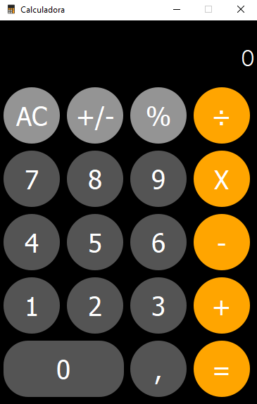

# Calculadora Iphone 
 
<div align="center">
 


 
 
 

</div>
 
> Projeto desenvolvido durante o período do curso
Técnico em Desenvolvimento de Sistemas no Senac Sorocaba.
 
### Ajustes e melhorias
 
O projeto ainda está em desenvolvimento e as próximas atualizações serão voltadas nas seguintes tarefas:
 
- [x] Interface Gráfica
- [x] Layout do Iphone
- [ ] Ajustar tamanho da fonte do display
- [ ] Implementar notação cientifica
- [ ] Prédefinir o tamanho fixo da interface
 
## 💻 Pré-requisitos
 
Antes de começar, verifique se você atendeu aos seguintes requisitos:
 
- Você instalou a versão mais recente do `<Python 3.12>
- Configurar o ambiente virtual:
      -python -m venv env
- Você tem uma máquina `<Windows / Linux >`.
-
- Você tem que instalar as seguintes depedencias:
    -'PyQt5'
    -'Auto-Py-To-Exe'
- Você leu `<guia / link / documentação_relacionada_ao_projeto>`.
 
## 🚀 Instalando <Calculadora iPhone>
 
Para instalar o <nome_do_projeto>, siga estas etapas:
 
Windows:
```
python -m venv env
env\Scripts\Activate.ps1
python -m pip install pyqt5
python -m pip install auto-py-to-exe
```
 
## ☕ Usando <Calculadora iPhone>
 
Para usar <python.main>, siga estas etapas:
 
```
python main.py
```
 
Adicione comandos de execução e exemplos que você acha que os usuários acharão úteis. Fornece uma referência de opções para pontos de bônus!
 
## 📫 Contribuindo para <Calculadora iPhone>
 
Para contribuir com <nome_do_projeto>, siga estas etapas:
 
1. Bifurque este repositório.
2. Crie um branch: `git checkout -b <Calculadora-iphone>`.
3. Faça suas alterações e confirme-as: `git commit -m '<mensagem_commit>'`
4. Envie para o branch original: `git push origin <nome_do_projeto> / <local>`
5. Crie a solicitação de pull.
 
Como alternativa, consulte a documentação do GitHub em [como criar uma solicitação pull](https://help.github.com/en/github/collaborating-with-issues-and-pull-requests/creating-a-pull-request).
 
 
<table>
  <tr>
    <td align="center">
      <a href="#" title="Leonardo Sampaio">
        <br>
      </a>
    </td>
  </tr>
</table>
 
## 😄 Seja um dos contribuidores
 
Quer fazer parte desse projeto? Clique [AQUI](CONTRIBUTING.md) e leia como contribuir.
 
## 📝 Licença
 
Esse projeto está sob licença. Veja o arquivo [LICENÇA](LICENSE.md) para mais detalhes.